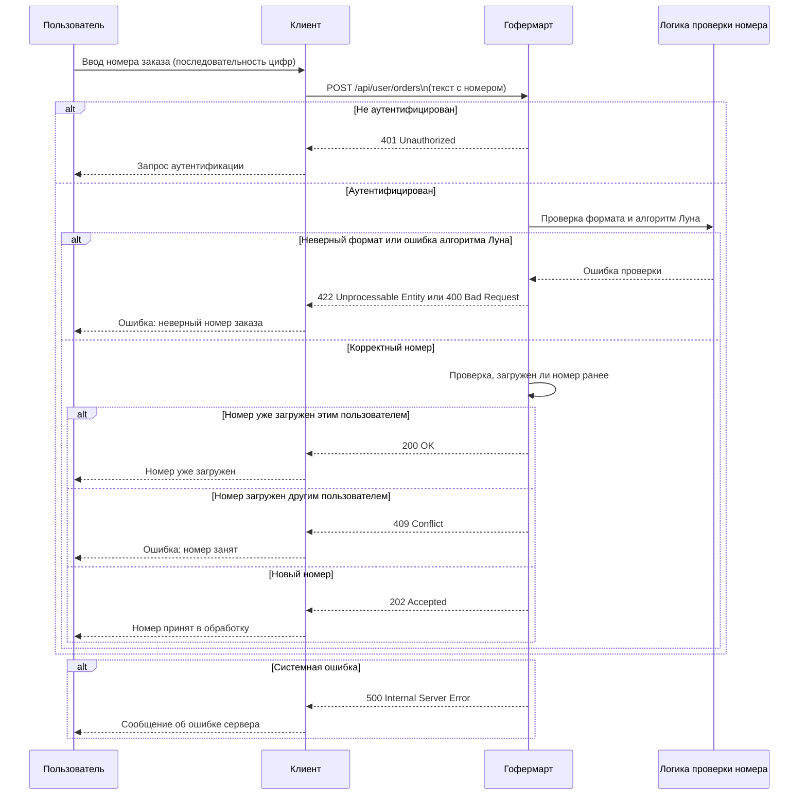

# POST /api/user/orders

## Схема работы

```mermaid
sequenceDiagram
  participant User as Пользователь
  participant ClientApp as Клиент
  participant ApiServer as Гофермарт
  participant Validator as Логика проверки номера

  User ->> ClientApp: Ввод номера заказа (последовательность цифр)
  ClientApp ->> ApiServer: POST /api/user/orders\n(текст с номером)

  alt Не аутентифицирован
    ApiServer -->> ClientApp: 401 Unauthorized
    ClientApp -->> User: Запрос аутентификации
  else Аутентифицирован
    ApiServer ->> Validator: Проверка формата и алгоритм Луна
    alt Неверный формат или ошибка алгоритма Луна
      Validator -->> ApiServer: Ошибка проверки
      ApiServer -->> ClientApp: 422 Unprocessable Entity или 400 Bad Request
      ClientApp -->> User: Ошибка: неверный номер заказа
    else Корректный номер
      ApiServer ->> ApiServer: Проверка, загружен ли номер ранее
      alt Номер уже загружен этим пользователем
        ApiServer -->> ClientApp: 200 OK
        ClientApp -->> User: Номер уже загружен
      else Номер загружен другим пользователем
        ApiServer -->> ClientApp: 409 Conflict
        ClientApp -->> User: Ошибка: номер занят
      else Новый номер
        ApiServer -->> ClientApp: 202 Accepted
        ClientApp -->> User: Номер принят в обработку
      end
    end
  end

  alt Системная ошибка
    ApiServer -->> ClientApp: 500 Internal Server Error
    ClientApp -->> User: Сообщение об ошибке сервера
  end
```