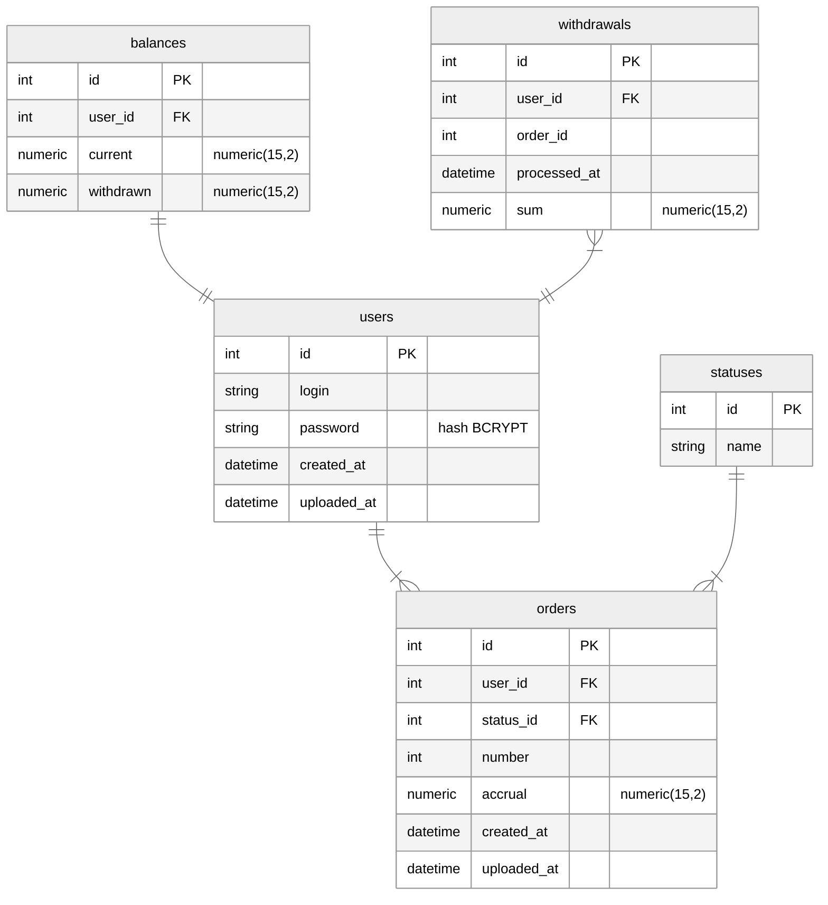

# Схема БД

```mermaid
---
config:
  theme: neutral
---
erDiagram
	direction TB
	statuses {
		int id PK ""  
		string name  ""  
	}
	users {
		int id PK ""  
		string login  ""  
		string password  "hash BCRYPT"  
		datetime created_at  ""  
		datetime uploaded_at  ""  
	}
	balances {
		int id PK ""  
		int user_id FK ""  
		numeric current  "numeric(15,2)"  
		numeric withdrawn  "numeric(15,2)"  
	}
	orders {
		int id PK ""  
		int user_id FK ""  
		int status_id FK ""  
		int number  ""  
		numeric accrual  "numeric(15,2)"  
		datetime created_at  ""  
		datetime uploaded_at  ""  
	}
	withdrawals {
		int id PK ""  
		int user_id FK ""  
		int order_id  ""  
		datetime processed_at  ""  
		numeric sum  "numeric(15,2)"  
	}

	users||--|{orders:"  "
	statuses||--|{orders:"  "
	balances||--||users:"  "
	withdrawals}|--||users:"  "

```