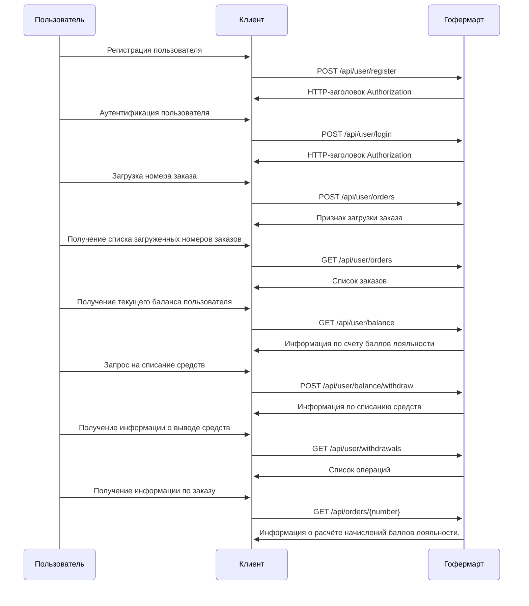

# Проект Гофермарт

## Технического задание 

[Спецификация](../SPECIFICATION.md)

## Общая схема взаимодействия

## Методы API
- [Загрузка номера заказа, POST /api/user/orders](./api/api_user_orders.md)

